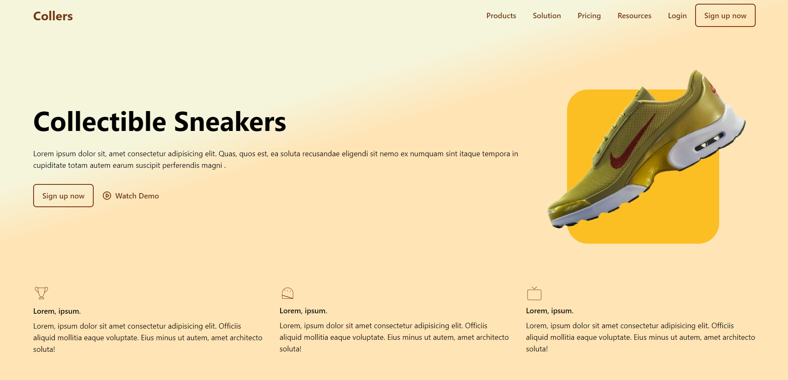

# Responsive Arayüz Tasarımı ve Kodlama Projesi

Bu proje, bir Figma tasarım dosyasını alarak, Tailwind CSS veya Bootstrap gibi bir CSS framework kullanarak responsive bir web arayüzü oluşturmayı hedeflemektedir. Ayrıca, dinamik tasarım özelliklerini de içerecek şekilde, ileri-geri butonları gibi elementlerin kaydırılmasını sağlamak gibi ek özellikler de projeye dahil edilecektir.

### Proje Hedefleri

- Figma tasarım dosyasından alınan arayüz tasarımını HTML ve CSS kullanarak kodlamak.
- Tasarımın responsive olmasını sağlamak, yani farklı ekran boyutlarına uyumlu olacak şekilde düzenlemeler yapmak.
- Dinamik özellikler eklemek, örneğin ileri-geri butonlarıyla elementlerin kaydırılmasını sağlamak gibi.

### Kullanılan Araçlar ve Teknolojiler

- **Figma**: Tasarım dosyasının oluşturulması ve tasarım detaylarının belirlenmesi için kullanılmıştır.
- **Tailwind CSS veya Bootstrap**: Responsive web tasarımı için kullanılacak CSS framework'ü.
- **HTML ve CSS**: Arayüz tasarımının kodlanması için kullanılacak temel teknolojiler.
- **JavaScript**: Dinamik özelliklerin eklenmesi ve kullanıcı etkileşimlerinin yönetilmesi için kullanılacak.

### Projenin Aşamaları

1. **Tasarımın Analizi**: Figma tasarım dosyasının detaylı bir şekilde incelenmesi ve responsive olarak nasıl kodlanabileceğine dair planın oluşturulması.
2. **Framework Seçimi**: Tailwind CSS veya Bootstrap gibi bir CSS framework'ünün seçilmesi ve projenin bu framework üzerinde nasıl oluşturulacağının belirlenmesi.
3. **HTML ve CSS Kodlama**: Tasarımın HTML ve CSS'e dökülmesi, responsive özelliklerin eklenmesi ve temel tasarımın oluşturulması.
4. **JavaScript Entegrasyonu**: Dinamik özelliklerin eklenmesi, ileri-geri butonlarıyla elementlerin kaydırılmasının sağlanması.
5. **Test ve Düzeltme**: Oluşturulan arayüzün farklı cihazlarda test edilmesi ve gerektiğinde düzeltmelerin yapılması.

### Ekran Görüntüleri

# JavaScript Quiz Uygulaması

Bu proje, JavaScript kullanılarak geliştirilmiş bir quiz uygulamasını içermektedir. Uygulama, kullanıcıya 10 soruluk bir quiz sunar ve her soru için 4 şık bulunur. Kullanıcılar, cevapları seçip sorular arasında gezinebilirler. Süre, her soru için 30 saniye olarak belirlenmiştir ve kullanıcılar bu süre içinde cevaplarını seçmelidirler.

## Özellikler

- Uygulama, JSONPlaceholder API'si üzerinden rastgele 10 soru alır.
- Her soru için, kullanıcıya cevap seçme imkanı sunulur. Ancak, ilk 10 saniye boyunca cevap şıklarına tıklanamaz, 10. saniyeden sonra tıklanabilir hale gelir.
- Süre, her soru için 30 saniyedir. Süre dolmadan önce bir sonraki soruya geçilmelidir.
- Geçmiş sorulara dönülemez. Kullanıcılar, yalnızca ileri yönde gezinebilirler.
- Test tamamlandığında, her soruya verilen yanıtlar bir tablo olarak gösterilir.

## Arayüz

Uygulamanın arayüzü, kullanıcı dostu ve görsel açıdan çekici bir şekilde tasarlanmıştır. Soruların altında, kullanıcıların süreyi görmelerini sağlayan bir süre göstergesi bulunur. Süre azaldıkça, yeşil bir çubuk giderek küçülür, kullanıcıya kalan süreyi gösterir.

## Ekran Görüntüleri

